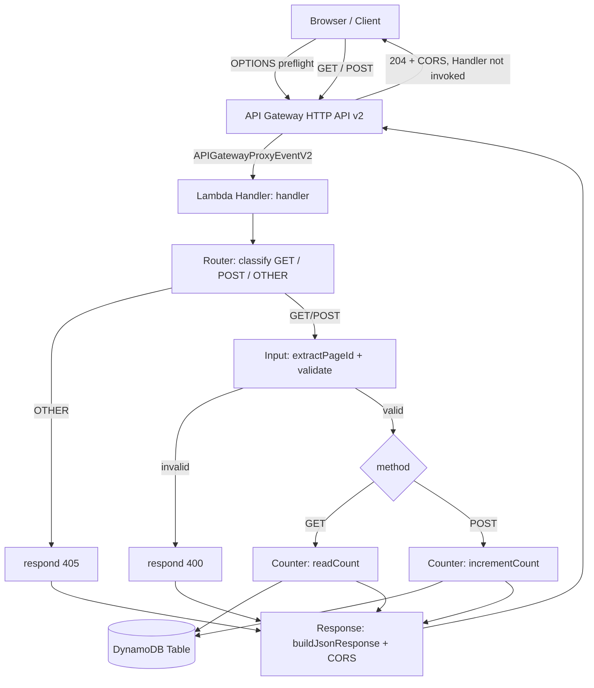
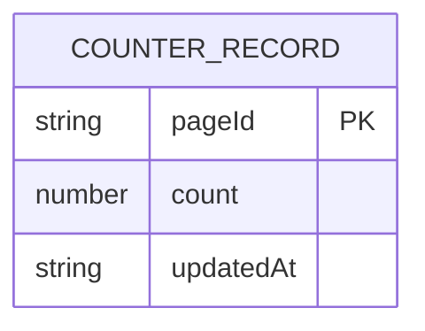

# Design Document

## Overview

The Visitor_Counter_API is a single-purpose serverless HTTP service that records and reports page visit counts. It is implemented in TypeScript and deployed as an AWS Lambda function behind an API Gateway HTTP API (payload format version 2.0). Packaging and infrastructure are managed by AWS SAM: the HTTP API owns CORS configuration and OPTIONS preflight handling, and the SAM template owns the build, the DynamoDB table, IAM policies, environment configuration, and multi-environment (dev/prod) deploys. Counter state persists in a single Amazon DynamoDB table owned by the stack.

The service exposes one logical endpoint with method-based semantics:

- **GET** performs a Read_Operation: it returns the current Count for a Page_Id (or the Global_Counter) without mutating state.
- **POST** performs an Increment_Operation: it atomically increases the Count by one and returns the resulting value.
- **OPTIONS** CORS Preflight_Requests are answered at the API Gateway HTTP API edge and never reach the Handler.
- Any other method reaching the Handler is rejected with HTTP 405.

The design centers on four concerns drawn from the requirements:

1. **Correctness under concurrency** — increments use a single DynamoDB `UpdateItem` with the atomic `ADD` operation, so concurrent increments never lose updates (Requirement 3). Atomic counters in DynamoDB are the standard mechanism for exactly this problem ([AWS: atomic counter operations](https://docs.aws.amazon.com/amazondynamodb/latest/developerguide/example_dynamodb_Scenario_AtomicCounterOperations_section.html)). Content was rephrased for compliance with licensing restrictions.
2. **Strict, fail-closed input handling** — Page_Id, JSON body, and body size are validated before any Data_Store access, returning HTTP 400 on any violation (Requirement 7).
3. **Predictable HTTP surface** — a small routing layer maps methods and error classes to fixed status codes (200, 400, 405, 500) and always attaches CORS headers to the Handler's own responses (Requirements 6, 8); preflight is handled at the gateway edge.
4. **Deployability and verifiability** — AWS SAM manages the build, the DynamoDB table, IAM, environment configuration, and multi-environment (dev/prod) deploys, and a Jest suite with `aws-sdk-client-mock` enforces coverage gates (Requirements 9, 10, 11).

### Research Notes

- **Atomic increment approach**: DynamoDB `UpdateItem` with `ADD #count :one` (or an equivalent `SET #count = if_not_exists(#count, :zero) + :one`) is atomic on a single item. It also creates the item if it does not exist, satisfying the "increment a non-existent page starts at 1" requirement (5) in a single call. Using `ReturnValues: "UPDATED_NEW"` returns the post-increment Count without a second read.
- **HTTP API v2 event shape**: With payload format 2.0, the handler receives the HTTP method at `requestContext.http.method`, query parameters in `queryStringParameters` (duplicate keys combined with commas), lowercased `headers`, and a string `body` that is base64-encoded when `isBase64Encoded` is true ([AWS: Lambda proxy integrations for HTTP APIs](https://docs.aws.amazon.com/apigateway/latest/developerguide/http-api-develop-integrations-lambda.html), [middy: API Gateway HTTP event](https://middy.js.org/docs/events/api-gateway-http/)). Content was rephrased for compliance with licensing restrictions. The design decodes the body to raw bytes before size checks so that Requirement 7.6 (8192-byte limit) measures actual byte length.

## Architecture

The service is organized into a thin I/O boundary (the Lambda handler) and pure logic layers, so that validation, routing, and response shaping can be property-tested without AWS.



CORS preflight (OPTIONS) is answered by the API Gateway HTTP API at the edge using its gateway-managed CORS configuration and never reaches the Handler. The Router therefore only ever classifies GET, POST, or OTHER; an OPTIONS request effectively will not arrive, and if one somehow did it would fall into OTHER and yield HTTP 405.

**Layering and rationale:**

- **Handler (`src/index.ts`)** — the only module that touches the AWS SDK and reads environment variables. It constructs the DynamoDB client once (module scope, reused across warm invocations), then delegates.
- **Router** — inspects `requestContext.http.method` (compared case-insensitively per Requirement 8.1) and dispatches to GET, POST, or OTHER. Preflight is gateway-owned, so OPTIONS is not a handled case. Keeping routing pure makes method handling and 405 behavior directly testable.
- **Input module** — extracts and validates the Page_Id and body. Pure functions; no I/O. This is where all HTTP 400 decisions live.
- **Counter service** — the two data operations (`readCount`, `incrementCount`). This is the only place that builds DynamoDB commands.
- **CORS module** — resolves the Allow_Origin from the environment and produces the header set stamped on the Handler's own responses. It no longer builds preflight responses; preflight is owned by the HTTP API.
- **Response module** — serializes bodies and merges CORS headers, guaranteeing Requirement 6.4 (Allow_Origin on every Handler response) by construction.

**Key design decision — a single try/catch envelope:** the handler wraps routing in a top-level catch that maps any unexpected error to HTTP 500 (Requirement 8.2) while still attaching CORS headers. Because increments are a single atomic call that either succeeds or throws, an error path never leaves a partially applied increment (Requirements 1.6, 3.3, 8.3).

**Key design decision — error observability without leaking detail:** the same top-level catch is the single place server-side failures are logged. `DataStoreError` preserves the underlying SDK error via its `cause`, and the catch emits exactly one Structured_Log to standard error — a single-line JSON object `{ level: "error", operation: "READ" | "INCREMENT" | "UNEXPECTED", name, message, stack }` via `console.error(JSON.stringify(...))` — before returning the generic response. The response body is unchanged (still the fixed generic message per condition), so the exact cause is observable in CloudWatch Logs while nothing internal is leaked to the client (Requirements 8.4, 8.5). The 400/405 paths return before reaching this catch and are not logged (Requirement 8.6).

## Components and Interfaces

### Handler entry point

```typescript
// src/index.ts
import type { APIGatewayProxyEventV2, APIGatewayProxyStructuredResultV2 } from "aws-lambda";

export const handler = async (
  event: APIGatewayProxyEventV2
): Promise<APIGatewayProxyStructuredResultV2>;
```

Responsibilities: resolve CORS config, route by method, translate results/errors into HTTP responses. Holds the module-scoped `DynamoDBClient`.

### Router

```typescript
type Method = "GET" | "POST" | "OTHER";

// Normalizes the raw method string case-insensitively (Req 8.1).
// OPTIONS preflight is owned by the HTTP API and does not reach the Handler,
// so it is not a handled case here; anything that is not GET/POST is OTHER (→ 405).
function classifyMethod(rawMethod: string): Method;
```

### Input extraction and validation

```typescript
// Result of resolving which counter a request targets.
interface TargetResolution {
  pageId: string | null; // null => Global_Counter
}

// Precedence: non-empty `page` query param wins over `pageId` body field (Req 4.1–4.4).
function resolveTarget(
  queryStringParameters: Record<string, string> | undefined,
  parsedBody: unknown
): TargetResolution;

// Validation outcome for a request.
type ValidationError =
  | { kind: "INVALID_JSON" }
  | { kind: "BODY_TOO_LARGE" }
  | { kind: "PAGE_ID_EMPTY" }
  | { kind: "PAGE_ID_TOO_LONG" }
  | { kind: "PAGE_ID_DISALLOWED_CHARS" };

// Returns null when the page id is valid, or when the target is the Global_Counter.
function validatePageId(pageId: string | null): ValidationError | null;

// Decodes the (possibly base64) body to bytes, enforces the 8192-byte cap (Req 7.6),
// then parses JSON (Req 7.1). Empty/absent body is treated as no body.
function parseBody(
  rawBody: string | undefined,
  isBase64Encoded: boolean
): { parsed: unknown } | { error: ValidationError };
```

Validation constants:

- `MAX_PAGE_ID_CODE_POINTS = 128` — measured in Unicode code points via `[...pageId].length` so surrogate pairs count as one (Req 7.2).
- `PERMITTED_PAGE_ID = /^[A-Za-z0-9\-_.\/]+$/` — the Permitted_Character_Set (Req 7.3, 7.5).
- `MAX_BODY_BYTES = 8192` — measured on decoded bytes via `Buffer.byteLength` (Req 7.6).

The Global_Counter uses a fixed reserved key rather than a real Page_Id, so it cannot collide with any user-supplied Page_Id (the reserved key is chosen outside the Permitted_Character_Set space, e.g. `"__global__"` stored under a distinct partition key value).

### Counter service

```typescript
interface CounterResult {
  count: number;        // non-negative integer
  updatedAt: string | null; // ISO 8601, or null when never incremented
}

// GET path. Reads item; returns {count: 0, updatedAt: null} when absent (Req 5).
// Throws on Data_Store failure (mapped to 500 by the handler, Req 2.4 / 5.3).
function readCount(
  client: DynamoDBClient,
  tableName: string,
  key: CounterKey
): Promise<CounterResult>;

// POST path. Single atomic UpdateItem with ADD; returns post-increment value (Req 1, 3).
// Throws on Data_Store failure (mapped to 500, Req 1.6 / 3.3).
function incrementCount(
  client: DynamoDBClient,
  tableName: string,
  key: CounterKey,
  now: string // ISO 8601 timestamp for this increment
): Promise<CounterResult>;
```

The atomic increment command:

```typescript
new UpdateItemCommand({
  TableName: tableName,
  Key: { pageId: { S: keyValue } },
  UpdateExpression: "SET #c = if_not_exists(#c, :zero) + :one, #u = :now",
  ExpressionAttributeNames: { "#c": "count", "#u": "updatedAt" },
  ExpressionAttributeValues: {
    ":zero": { N: "0" },
    ":one": { N: "1" },
    ":now": { S: now },
  },
  ReturnValues: "UPDATED_NEW",
});
```

This is a single atomic mutation (Req 3.2). DynamoDB serializes concurrent `UpdateItem` calls on the same item, so N concurrent increments yield initial + N with no lost updates (Req 3.1). `if_not_exists` creates the record at 1 when absent (Req 5 / 1.5). `ReturnValues: "UPDATED_NEW"` returns the new count and timestamp in one round trip (Req 1.3).

### CORS module

```typescript
// Resolves Allow_Origin: ALLOW_ORIGIN if non-empty, else "*" (Req 6.1, 6.2).
function resolveAllowOrigin(env: Record<string, string | undefined>): string;

// Headers stamped on EVERY response the Handler returns (Req 6.4).
function corsHeaders(allowOrigin: string): Record<string, string>;
```

Preflight is not built by this module. OPTIONS Preflight_Requests are answered by the HTTP API using its gateway-managed CORS configuration (204, allowed origin = configured Allow_Origin, allowed methods including `GET, POST, OPTIONS`, allowed headers including `Content-Type`), without invoking the Handler (Req 6.3). The CORS module only resolves the Allow_Origin and stamps it onto the Handler's own responses.

### Response module

```typescript
function buildJsonResponse(
  statusCode: number,
  body: unknown,
  allowOrigin: string
): APIGatewayProxyStructuredResultV2;

function buildErrorResponse(
  statusCode: number,
  message: string,
  allowOrigin: string
): APIGatewayProxyStructuredResultV2;
```

Both merge `corsHeaders(allowOrigin)` and set `Content-Type: application/json`, so no response path can omit CORS headers.

## Data Models

### DynamoDB table

A single table with a simple primary key.

| Attribute   | Type          | Role                                                          |
|-------------|---------------|---------------------------------------------------------------|
| `pageId`    | String (S)    | Partition key. The Page_Id, or the reserved Global_Counter key. |
| `count`     | Number (N)    | The Count. Non-negative integer.                              |
| `updatedAt` | String (S)    | ISO 8601 Updated_At of the last increment. Absent until first increment. |

- Partition key `pageId` gives O(1) point reads/writes and makes each distinct Page_Id a separate Counter_Record (Req 4.5), while identical Page_Id values map to the same item (Req 4.6). Case sensitivity is inherited from DynamoDB's exact byte comparison of the key.
- `updatedAt` is only written by increments. A read of an item that has never been incremented (or an absent item) yields `updatedAt: null` (Req 2.3, 5).
- Table name is supplied to the Lambda via the `TABLE_NAME` environment variable.



### Application types

```typescript
interface CounterKey { pageId: string; } // reserved value for Global_Counter

interface CounterResponseBody {
  count: number;            // non-negative integer
  updatedAt: string | null; // ISO 8601 or null
}

interface ErrorResponseBody {
  error: string;            // human-readable message
}
```

## Infrastructure (AWS SAM)

Packaging and infrastructure are declared in a single AWS SAM `template.yaml`. SAM owns the build, the HTTP API, the DynamoDB table, IAM, environment configuration, and multi-environment deploys. This replaces the previous hand-rolled esbuild script (`scripts/build.mjs`) and manual `dist/visitor-counter.zip` archive, both of which are deleted by this migration.

### template.yaml structure

- **`AWS::Serverless::HttpApi`** — the HTTP_API (payload format version 2.0). It declares gateway-managed `CorsConfiguration` (allowed origin from the `AllowOrigin` parameter, allowed methods including `GET`, `POST`, `OPTIONS`, allowed headers including `Content-Type`) so the gateway answers OPTIONS Preflight_Requests at the edge without invoking the Handler. GET and POST routes are wired to the Handler.
- **`AWS::Serverless::Function`** — the Handler, with:
  - `Runtime: nodejs24.x`
  - `Environment.Variables`: `TABLE_NAME` (the per-Stage table name) and `ALLOW_ORIGIN` (the `AllowOrigin` parameter value).
  - `Metadata.BuildMethod: esbuild` with `Minify: true`, `Target: node24`, `Sourcemap: true`, and `EntryPoints: [index.ts]`, so `sam build` produces a self-contained, dependency-bundled artifact.
  - Events binding the GET and POST routes on the HTTP_API.
- **DynamoDB table** — an `AWS::Serverless::SimpleTable` (or `AWS::DynamoDB::Table`) owned and lifecycle-managed by the stack, with a `pageId` partition key.
- **IAM** — a `DynamoDBCrudPolicy` (or an equivalent inline least-privilege policy) scoped to only this stack's table, limited to the DynamoDB actions needed for reads and atomic increments.

### Stage parameterization

- A **`Stage`** parameter (`dev` or `prod`) drives per-Stage table naming (e.g. `visitor-counter-${Stage}`), so `dev` and `prod` use separate tables. The resolved name is injected into the Handler via `TABLE_NAME`.
- An **`AllowOrigin`** parameter supplies the Allow_Origin. It defaults to `*` for `dev` and has no default for `prod` (must be supplied at deploy). The same parameter feeds both the HTTP_API `CorsConfiguration` and the Handler's `ALLOW_ORIGIN` env var, so gateway and Handler always agree (Req 6.5).
- **`samconfig.toml`** defines `dev` and `prod` config-envs, each a separate CloudFormation stack in the same AWS account, selected via `sam deploy --config-env dev|prod`.

### Local development

`sam local start-api` runs the HTTP_API and Handler locally for manual Postman testing. This is a development-only capability: it requires Docker locally, is not part of the automated CI gate, and CI must not require Docker (Req 11.6).

For local runs the Handler targets a local Data_Store (DynamoDB Local) rather than a deployed table. This requires three cooperating pieces, none of which affect deployed behavior:

1. **Handler endpoint override.** The module-scoped client reads the standard `AWS_ENDPOINT_URL_DYNAMODB` environment variable and, when it is a non-empty value, passes it as an explicit `endpoint`; otherwise it constructs `new DynamoDBClient({})` and resolves the real endpoint from the Lambda execution environment (Requirement 11.7). (Relying on the SDK to auto-apply that env var is not sufficient for this client/version, so the Handler applies it explicitly.)
2. **Template declaration.** `AWS_ENDPOINT_URL_DYNAMODB` is declared under the function's `Environment.Variables` with an empty default. SAM's `sam local --env-vars` only *overrides* variables already declared on the function, so the key must exist (empty) for the local override to take effect. It stays empty in every deployed Stage, which the Handler treats as unset.
3. **Shared local table set.** DynamoDB Local is run with `-sharedDb` so tables are visible regardless of region/credentials; without it, DynamoDB Local partitions tables per region + access key and the local invocation sees an empty partition.

The `ResourceNotFoundException` returned when the local endpoint/table is not correctly wired is the expected READ/INCREMENT Data_Store failure path (mapped to HTTP 500 with one Structured_Log), not a defect in the Handler.

## Correctness Properties

*A property is a characteristic or behavior that should hold true across all valid executions of a system — essentially, a formal statement about what the system should do. Properties serve as the bridge between human-readable specifications and machine-verifiable correctness guarantees.*

The pure logic layers (validation, target resolution, body parsing, CORS resolution, response shaping) and the atomic counter behavior are well suited to property-based testing: they are deterministic functions with large input spaces and universal invariants. DynamoDB's real cross-process concurrency, the SAM build/deploy, and coverage gates are covered by integration/verification notes in the Testing Strategy instead. For the concurrency property, tests run against a model of DynamoDB's atomic `ADD` semantics (serialized single-item updates) using `aws-sdk-client-mock`.

### Property 1: Increment adds exactly one and records the timestamp

*For any* target key and *any* initial state (an existing Count c ≥ 0, or an absent record treated as 0), a single Increment_Operation results in a returned Count of c + 1, sets Updated_At to the increment timestamp, and is issued as exactly one atomic `UpdateItem` command (no read-modify-write).

**Validates: Requirements 1.1, 1.4, 1.5, 3.2**

### Property 2: Successful increment response shape

*For any* successful increment result, the response has HTTP status 200 and a JSON body whose `count` is a non-negative integer and whose `updatedAt` is a valid ISO 8601 timestamp string.

**Validates: Requirements 1.3**

### Property 3: Read returns stored (or zero) count without mutating

*For any* target key, a Read_Operation returns the stored Count when a record exists and `{ count: 0, updatedAt: null }` when it does not, never issuing a write command (no `PutItem`/`UpdateItem`) and never creating a record.

**Validates: Requirements 2.1, 5.1**

### Property 4: Successful read response shape

*For any* successful read result, the response has HTTP status 200 and a JSON body whose `count` is a non-negative integer and whose `updatedAt` is either a valid ISO 8601 timestamp string or null.

**Validates: Requirements 2.3**

### Property 5: Concurrent increments never lose updates

*For any* integer N ≥ 2 and *any* initial Count c ≥ 0, applying N increments to the same key against a model of DynamoDB's atomic counter semantics yields a final Count of exactly c + N, independent of application order.

**Validates: Requirements 3.1**

### Property 6: Query parameter takes precedence in target resolution

*For any* non-empty `page` query parameter value and *any* body `pageId` value (present or absent), target resolution selects the `page` query value as the Page_Id.

**Validates: Requirements 4.1, 4.3**

### Property 7: Body pageId used when query parameter is absent or empty

*For any* request with no non-empty `page` query parameter and a non-empty body `pageId` value, target resolution selects the body `pageId` value as the Page_Id.

**Validates: Requirements 4.2**

### Property 8: Absence of both selectors resolves to the Global_Counter

*For any* combination in which neither a non-empty `page` query parameter nor a non-empty body `pageId` field is supplied (both absent, both empty, or one absent and the other empty), target resolution selects the Global_Counter.

**Validates: Requirements 4.4**

### Property 9: Page_Id key derivation is deterministic and injective

*For any* two Page_Id values, deriving the storage key twice from the same value yields identical keys, and deriving keys from two values that are not identical under exact, case-sensitive comparison yields distinct keys.

**Validates: Requirements 4.5, 4.6**

### Property 10: Allow_Origin resolution

*For any* environment, the resolved Allow_Origin equals the `ALLOW_ORIGIN` value when it is a non-empty string and equals `*` when `ALLOW_ORIGIN` is unset or empty; this resolved value appears in the CORS headers.

**Validates: Requirements 6.1, 6.2**

### Property 11: Every Handler response carries the resolved Allow_Origin header

*For any* request that reaches the Handler (any method, any validity, any success or failure outcome) and *any* environment, the response the Handler produces includes an `Access-Control-Allow-Origin` header whose value equals the resolved Allow_Origin, regardless of the HTTP status code.

**Validates: Requirements 6.4**

### Property 12: Malformed JSON bodies are rejected

*For any* non-empty request body string that is not valid JSON, request handling responds with HTTP status 400 and a JSON error message indicating invalid JSON, without issuing any Data_Store mutation.

**Validates: Requirements 7.1**

### Property 13: Over-length Page_Id is rejected

*For any* Page_Id whose length exceeds 128 Unicode code points, validation responds with HTTP status 400 and a JSON error indicating the maximum-length violation, without any Data_Store mutation. (Code points are counted so that surrogate-pair characters count as one.)

**Validates: Requirements 7.2**

### Property 14: Disallowed characters in Page_Id are rejected

*For any* Page_Id containing at least one character outside the Permitted_Character_Set, validation responds with HTTP status 400 and a JSON error indicating disallowed characters, without any Data_Store mutation.

**Validates: Requirements 7.3**

### Property 15: Valid Page_Id is accepted

*For any* Page_Id whose length is between 1 and 128 Unicode code points inclusive and that contains only characters from the Permitted_Character_Set, validation accepts the Page_Id and the request is processed.

**Validates: Requirements 7.4, 7.5**

### Property 16: Over-size request bodies are rejected before parsing

*For any* request body whose decoded byte length exceeds 8192 bytes, request handling responds with HTTP status 400 and a JSON error indicating the size violation, without parsing the body as JSON and without any Data_Store mutation.

**Validates: Requirements 7.6**

### Property 17: Method classification and unsupported-method rejection

*For any* HTTP method string reaching the Handler, it is treated as supported exactly when its case-insensitive value is `GET` or `POST`; any other method produces HTTP status 405 with a JSON error message and no Data_Store mutation. (OPTIONS preflight is answered by the HTTP API and does not reach the Handler.)

**Validates: Requirements 8.1**

## Error Handling

Errors are grouped into classes, each mapped to a fixed HTTP status. The handler wraps all routing in a single top-level `try/catch` so no code path can escape without a CORS-bearing JSON response.

| Condition | Status | Body | Requirements |
|-----------|--------|------|--------------|
| Invalid JSON body | 400 | `{ error: "Request body is not valid JSON" }` | 7.1 |
| Page_Id too long (> 128 code points) | 400 | `{ error: "pageId exceeds the maximum length of 128 code points" }` | 7.2 |
| Page_Id has disallowed characters | 400 | `{ error: "pageId contains disallowed characters" }` | 7.3 |
| Page_Id empty (explicit empty target) | 400 | `{ error: "pageId must not be empty" }` | 7.4 |
| Body too large (> 8192 bytes) | 400 | `{ error: "Request body exceeds the maximum allowed size" }` | 7.6 |
| Unsupported HTTP method | 405 | `{ error: "Method not supported" }` | 8.1 |
| Data_Store read failure | 500 | `{ error: "Count could not be read" }` | 2.4, 5.3 |
| Data_Store increment failure (incl. conflict/throttle) | 500 | `{ error: "Increment could not be recorded" }` | 1.6, 3.3 |
| Any other unexpected error | 500 | `{ error: "Request could not be processed" }` | 8.2 |

**Design guarantees:**

- **Fail-closed validation ordering:** body-size check → JSON parse → target resolution → Page_Id validation. Every step runs before any Data_Store call, so a 400 never touches the store (Requirement 7, "without modifying any Counter_Record").
- **No partial increments:** because an increment is a single atomic `UpdateItem`, a failure means the operation either fully applied or not at all; on any thrown error the handler returns 500 and the record is left unchanged (Requirements 1.6, 3.3, 8.3).
- **Reads never mutate:** the read path only issues `GetItem`, so a read failure inherently leaves state unchanged (Requirements 2.4, 5.3).
- **CORS on errors:** all error responses are built through `buildErrorResponse`, which merges CORS headers (Requirement 6.4).
- **Observability on 500s:** every 500 path (READ, INCREMENT, UNEXPECTED) emits exactly one Structured_Log to standard error carrying the operation context and the underlying error's `name`/`message`/`stack`, so the exact cause reaches CloudWatch Logs; the client-facing body stays limited to the generic message for that row and carries no internal detail (Requirements 8.4, 8.5). The 400/405 rows are expected client outcomes and are not logged (Requirement 8.6).
- **Preflight is not Handler logic:** OPTIONS Preflight_Requests are answered by the API Gateway HTTP API at the edge and never reach the Handler, so they are not part of the Handler's method handling above; an OPTIONS request that somehow reached the Handler would be classified as OTHER and yield HTTP 405.

## Testing Strategy

The suite uses **Jest** with **ts-jest**, and **aws-sdk-client-mock** to simulate DynamoDB (both success and failure) instead of a live table (Requirements 10.2). It combines property-based tests for universal logic with example/integration tests for specific scenarios and infrastructure.

### Property-Based Tests

- **Library:** [`fast-check`](https://github.com/dubzzz/fast-check) integrated with Jest. Property-based testing is not implemented from scratch.
- **Iterations:** each property test runs a minimum of 100 iterations (`fc.assert(..., { numRuns: 100 })`).
- **Tagging:** each property test is annotated with a comment of the form
  `// Feature: visitor-counter-api, Property {number}: {property text}`.
- **Coverage:** each of Properties 1–17 is implemented by a single property-based test.
- **Generators:**
  - Valid Page_Id: strings of code-point length 1–128 drawn from the Permitted_Character_Set (letters, digits, `-`, `_`, `.`, `/`), including multi-byte code points where relevant.
  - Invalid Page_Id: over-length strings, strings containing ≥ 1 disallowed character, and empty strings.
  - Bodies: valid JSON objects, malformed JSON strings (filtered to exclude accidentally valid JSON), and oversize byte payloads (including multi-byte characters to exercise byte-length vs. code-point counting).
  - Origins: arbitrary non-empty strings plus the unset/empty cases.
  - Concurrency (Property 5): a stateful mock modeling atomic `ADD` on a single item, exercised with arbitrary N ≥ 2 and arbitrary initial counts.

### Example and Integration Tests

- **Increment/read routing to the Global_Counter** (Requirements 1.2, 2.2): POST/GET with no selector operate on the reserved global key.
- **Global_Counter graceful init** (Requirement 5.2): GET with no selector against an absent record returns `{ count: 0, updatedAt: null }`.
- **Data_Store failure mapping** (Requirements 1.6, 2.4, 3.3, 5.3, 10.3): mocked rejections yield HTTP 500 with an error body; for increments, assert exactly one command was attempted and it failed (no partial write).
- **Conflict/throttle on increment** (Requirement 3.3): mocked conflict-style rejection yields 500.
- **Unexpected internal error** (Requirement 8.2): an injected throwing dependency yields a generic 500.
- **Error observability on 500s** (Requirements 8.4, 8.5, 8.6): with a `console.error` spy, each 500 path (READ, INCREMENT, UNEXPECTED) emits exactly one Structured_Log whose JSON carries the operation context and the underlying error's name/message/stack, while the response body remains the generic message and leaks no internal detail; the 400/405 paths emit no log. Logging is a side effect, not a pure function over inputs, so it is verified with example tests rather than a property.
- **Unsupported method** (Requirements 8.1, 10.4): a request with an unsupported method yields 405 with an error body.
- **Invalid input** (Requirements 7.x, 10.5): representative invalid inputs yield 400 with an error body.
- **Required assertions coverage** (Requirement 10.1): the suite asserts the enumerated status/body shapes for increment, read, graceful init, CORS header presence, and sanitization.

### SAM Build and Infrastructure Verification (Requirements 9, 11)

Property-based testing does not apply to SAM build/deploy or CloudFormation infrastructure (they are declarative packaging and configuration, not functions over inputs). These are verified with SAM tooling rather than unit or property tests:

- **Template validation** (9.3): `sam validate --lint` runs in CI and must succeed.
- **Build correctness** (9.1, 9.2): `sam build` produces a self-contained, dependency-bundled Handler artifact; a build failure exits non-zero and produces no deployable artifact.
- **No Docker in CI:** there is no Docker-based integration test in the automated CI gate; CI must not require Docker.
- **Local development:** `sam local start-api` is documented as a development-only manual capability for Postman testing, exercised by an operator locally, not by CI.

### Test file placement

- **Unit and property tests are colocated** with the code they exercise in `src/*.test.ts`, following the existing convention. These files are not moved by this migration.
- **A `tests/` folder is reserved** for future cross-cutting integration tests and is excluded from coverage collection so it cannot dilute the coverage gate.
- **`src/build.test.ts` is removed** by this migration (along with `scripts/build.mjs` and the hand-rolled `dist/visitor-counter.zip`), since the esbuild pipeline it tested is replaced by SAM build/deploy verification.

### Coverage Gate (Requirements 10.6, 10.7)

Jest is configured with a `coverageThreshold` of at least 95% statements and 90% branches over the source under test. When measured coverage falls below either threshold, Jest exits non-zero, failing the CI gate. No custom logic is needed — this is Jest's built-in behavior.

```jsonc
// jest.config (excerpt)
{
  "coverageThreshold": {
    "global": { "statements": 95, "branches": 90 }
  }
}
```

### Build and Deploy Pipeline (AWS SAM)

Build, packaging, and deploy are driven by AWS SAM instead of a hand-rolled esbuild script. The prior `scripts/build.mjs` and manual `dist/visitor-counter.zip` archive are removed.

1. **Validate** — `sam validate --lint` checks the `template.yaml` (run in CI, Requirement 9.3).
2. **Build** — `sam build` compiles and bundles the Handler via the esbuild BuildMethod (`Minify`, `Target: node24`, `Sourcemap`, `EntryPoints: [index.ts]`), producing a self-contained deployable artifact with all runtime dependencies bundled; a failed build exits non-zero and produces no artifact (Requirements 9.1, 9.2).
3. **Deploy** — `sam deploy --config-env dev` or `sam deploy --config-env prod` deploys each Stage as a separate CloudFormation stack in the same AWS account, using the `Stage` and `AllowOrigin` parameters from `samconfig.toml` (`AllowOrigin` defaults to `*` for dev and must be supplied for prod) (Requirements 9.4, 11.5).
4. **Local (dev-only)** — `sam local start-api` runs the HTTP_API and Handler locally for manual Postman testing; it requires Docker and is not part of the CI gate (Requirement 11.6).
